# CMPT 459 Final Project
David Wiebe | 301470104 | dlw13@sfu.ca\
Rachel Lagasse | 301395285 | rlagasse@sfu.ca

# Running the Program
The program can be called with the following.
```console
cd ./CMPT-459-Project
python src/main.py
```
It will take several minutes to run completely.
## Flags
The program has the following flags:\
`--verbose` to toggle verbose mode.\
`--data` to input the data path\
`--data-reduction` to set the data reduction factor. Must be at least 1.\
`--exploratory-data-analysis` to toggle exploratory data analysis.\
`--clustering` to toggle clustering.\
`--outlier-detection` to toggle outlier detection.\
`--feature-selection` to toggle feature selection.\
`--classification=[True|False]` to toggle classification.

# Report
## 1 Dataset - Rain in Australia
[View Data](./weatherAUS.csv)

We selected climatology [data from Kaggle](https://www.kaggle.com/datasets/jsphyg/weather-dataset-rattle-package) titled "Rain in Australia". 
This real-world dataset contains 10 years of rainfall data collected from various Australian weather stations. 
It has 23 features including a mix of numeric and categorical data. 
It has over 140,000 entries and a total size of 140MB.

The data includes a rich set of features to analyze. 
Numeric features include humidity, temperature and wind speed. 
Categorical features include location and wind direction. 
Most features are numeric, which affected our choice of classifiers. 
Our target variable for classification will be the feature `RainTomorrow` which predicts if there is rainfall the next day ($\geq$ 1mm).

## 2 Data Preprocessing
[View Code](./src/preprocessing.py)

The majority of data preprocessing was a straightforward exercise without. 
Our data had several features with $\gt 30\%$ missing data. 
It seemed impractical to impute these features, so we dropped them. 
We then imputed the mean on our numerical features. 
Likewise we imputed the mode for categorical features.
The feature `RainTomorrow` is converted from a string "yes" or "no" to a boolean $1$ or $0$

We extracted the year and month and stored them both as integer features. 
The date was originally stored as a string. 
Thankfully, Pandas has built in tools to do this efficiently.

Our data has considerable size. 
This allows us to skip creating synthetic data. 
We did need to perform data reduction.
All our tests were done at 20 times data reduction.  
Data reduction is controlled by the command line argument `--data-reduction=20`.
The minority class (it rains) is about one quarter of the data, so we decided against augmentation.
At the end of preprocessing our data had $20$ numerical features - not enough to require PCA.

Exploratory Data Analysis requires non-normalized data. 
Normalization is held off until it is needed in later stages of the project.


## 3 Exploratory Data Analysis
[View Code](./src/exploratory_analysis.py)

Exploratory data analysis helped us understand the data we are working with. 
We started by looking at variances and correlations. After that we created plots. 
Finally we highlight some of our findings here

Variances differ greatly between the features.
The lowest variance feature is `Year`. 
This makes sense as it has only a small handful of values.
The highest variance feature is `Humidity at 3 pm`. 
Note this is far more varied than `Humidity at 9 am` for unknown reasons.

Correlations were a mystery to us at first. 
The feature pairs with the lowest recorded variance weren't the features who appeared to have the lowest variance to our eyes.
This is because of the imputation of missing data.
Imputations place a lot of values on the mean of that particular feature.
Pairs with many imputations on either features get high variance.
Those without get incorrectly seen as lower in comparison.
As such correlations were not recorded.

Many data were collected and are shown below. 
We highlight the top and bottom three variances. 
We've also selected several plots.

### 3.1 Top Three Variances
| Feature  | Variance |
| -------- | -------- |
| Year     |   6.439  |
| Month    |  11.879  |
| Min Temp |  41.079  |

### 3.2 Bottom Three Variances
| Feature           | Variance |
| ----------------- | -------- |
| Location Encoding | 202.733  |
| Humidity at 9 am  | 356.825  |
| Humidity at 3 pm  | 421.468  |

### 3.3 Interesting Plots
<figure>
    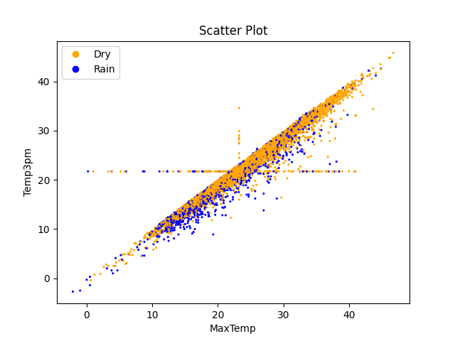
    <figcaption>Scatter plot of Max Temp vs Temp at 3 pm</figcaption>
</figure>
<br>
<figure>
    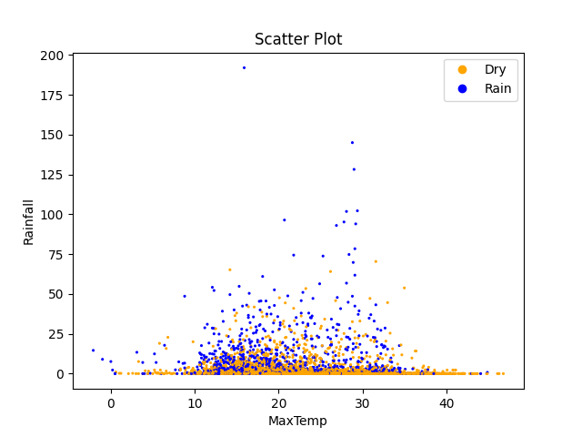
    <figcaption>Scatter plot of Max Temp vs Rainfall</figcaption>
</figure>
<br>
<figure>
    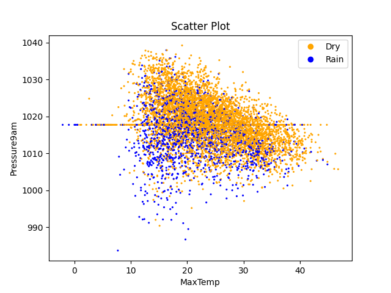
    <figcaption>Scatter plot of Max Temp vs Pressure at 9 am</figcaption>
</figure>
<br>
<figure>
    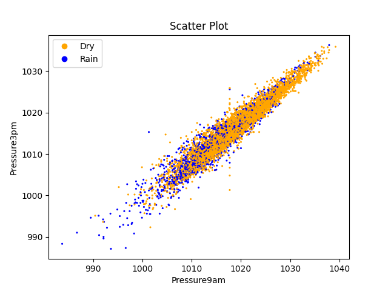
    <figcaption>Scatter plot of Pressure at 9 am vs Pressure at 3 pm</figcaption>
</figure>
<br>
<figure>
    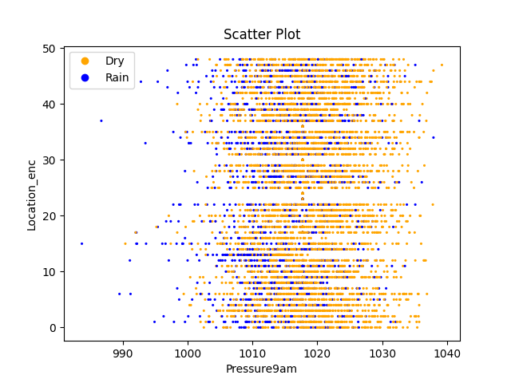
    <figcaption>Scatter plot of Location Encoding vs Pressure at 9 am</figcaption>
</figure>
<br>
<figure>
    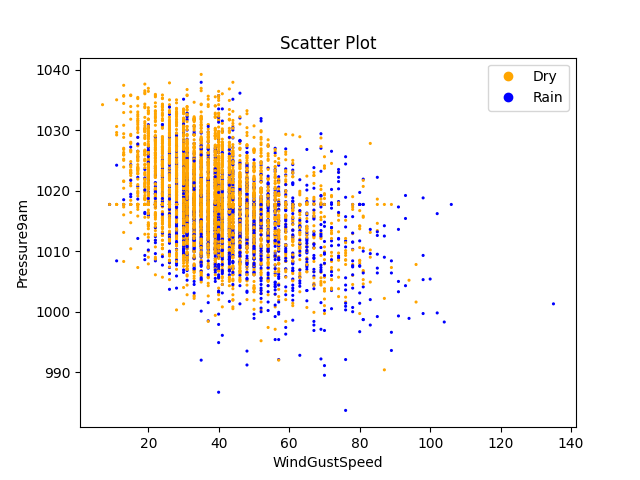
    <figcaption>Scatter plot of Wind Gust Speed vs Pressure at 9 am</figcaption>
</figure>
<br>
<figure>
    
    <figcaption>Scatter plot of Location Encoding vs Wind Gust Speed</figcaption>
</figure>

## 4 Clustering
[View Code](./src/clustering.py)

For clustering we chose to use KMeans, OPTICS, and DBSCAN. 
KMeans was chosen for its reliability. 
DBSCAN was chosen because we believed it would not get "distracted" by the high variances present in the data.
OPTICS was chosen to compliment DBSCAN.
We then visualized the clusterings.

We tuned hyperparameters to maximize Silhouette score. 
KMeans failed to produce any good results.
DBSCAN was the most fickle, but it gave the best result. 
DBSCAN assigned almost every point to a single cluster.
OPTICS despite our tuning assigned almost every point as an outlier.

### 4.1 Clustering Performance
| Metric            | KMeans | OPTICS | DBSCAN |
| ----------------- | ------ | ------ | ------ |
| Runtime           | 0.187  | 11.191 | 0.097  |
| Silhouette Scores | 0.172  | -0.392 | 0.581  |

### 4.2 Plots
<figure>
    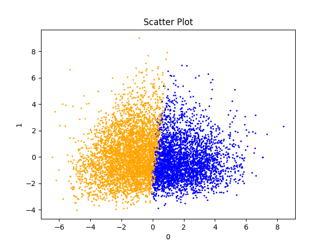
    <figcaption>KMeans Clustering</figcaption>
</figure>
<br>
<figure>
    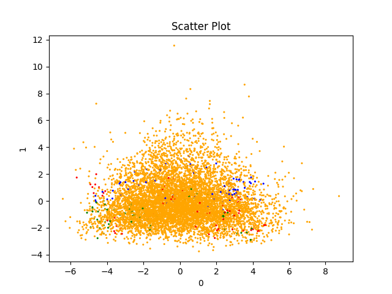
    <figcaption>OPTICS Clustering</figcaption>
</figure>
<br>
<figure>
    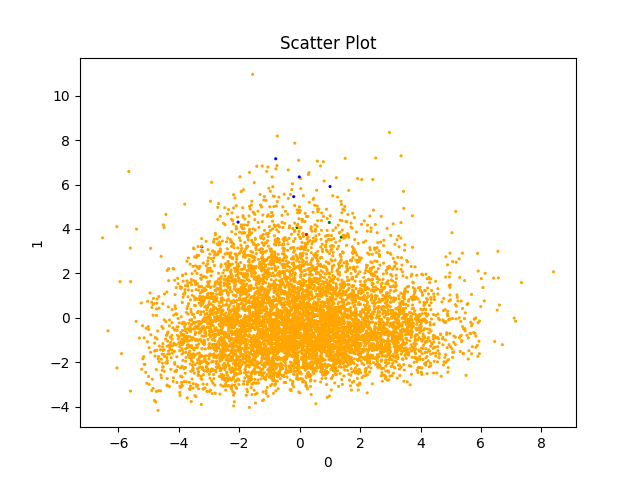
    <figcaption>DBSCAN Clustering</figcaption>
</figure>

## 5 Outlier Detection
[View Code](./src/outlier_detection.py)

Our two outlier detection methods are Local Outlier Factor and Kernel Density.
Local Outlier Factor was chosen as it is quick and simple to implement.
Kernel Density was chosen as we expected it to find patterns of odd behavior.

They both failed to find any real number of outliers ($\lt 1\%$). 
This is likely because we have no real outliers.
Our data is professionally collected.
There are no extreme values discovered by EDA.
Furthermore upon inspecting what values were classified as outliers by Local Outlier Factor are mostly days of high rain.
This is a good indication of the quality of our data.

### 5.1 Plots
<figure>
    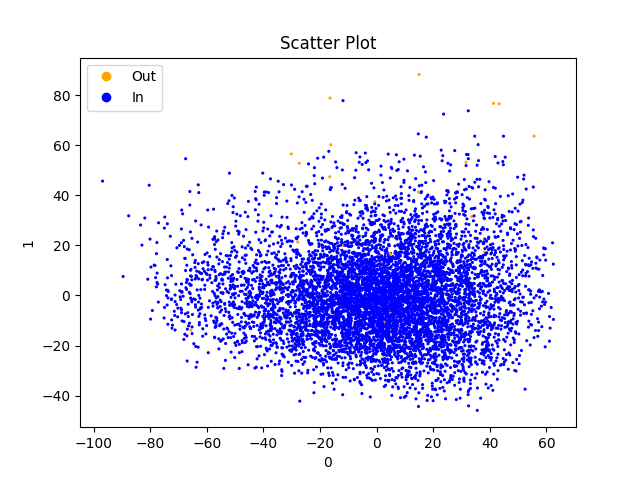
    <figcaption>Local Outlier Factor Outliers</figcaption>
</figure>
<br>
<figure>
    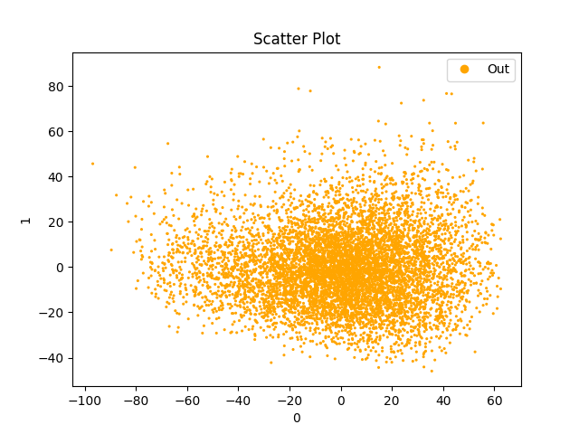
    <figcaption>Kernel Density Outliers</figcaption>
</figure>

## 6 Feature Selection
[View Code](./src/feature_selection.py)

We ran three different feature selection algorithms. 
They're all chosen because we didn't know what to pick.
Thankfully implementing all three gave us a good spread.
We selected Recursive Feature Elimination, Lasso Regression, and Mutual Information.
We ran these clustering algorithms and tuned them to produce 5 features each for comparison.
You can see the results in the table below. 
Our discussion of the results is after the table.

### 6.1 Selected Features
| Features Kept    | Recursive Feature | Lasso Regression | Mutual Information | Fraction |
| --------------- | ----------------- | ---------------- | ------------------ | -------- |
| Rainfall        | X                 | X                | X                  | $3/3$    |
| Wind Gust Speed | X                 | X                |                    | $2/3$    |
| Wind Speed 3 pm |                   | X                |                    | $1/3$    |
| Humidity 9 am   |                   |                  | X                  | $1/3$    |
| Humidity 3 pm   | X                 | X                | X                  | $3/3$    |
| Pressure 9 am   | X                 |                  | X                  | $2/3$    |
| Pressure 3 pm   | X                 | X                | X                  | $3/3$    |

### 6.2 Discussion of Selected Features
Three features are selected by all of the three models. 
These features are Rainfall, Humidity at 3 pm, and Pressure at 3 pm.
- Rainfall today is an obvious predictor of rainfall tomorrow
- Humidity and pressure both make sense for weather prediction

Humidity and pressure were both more commonly referenced at 3 pm vs 9 am.
This implies weather conditions later in the day have stronger predictive powers than those later in the day.
Of course this is obvious to us humans, but its cool the feature selection figured it out.

## 7 Classification
[View Code](./src/classification.py)

We performed our classification with 4 kinds of classifiers, over 4 metrics, and on 4 subsets of our data.
Analysis was done with 5 fold cross validation.
We originally planned to do 10 but for performance we cut it down.

1. We chose the following classifiers
   - Support Vector Machines
   - K Nearest Neighbours
   - Random Forest Classifiers
   - Ensemble Voting Classifiers of the best 3, 5, and 7 base classifiers
2. For metrics we picked 4 and sorted by accuracy
   - Accuracy
   - Precision
   - Recall
   - F1 score
3. Tests were run over 4 different datasets
   - All of the data 
   - Features picked by RFE
   - Features picked by Mutual Information
   - Features picked by Lasso

## 8 Hyperparameter Tuning
[View Code](./src/main.py)

### Support Vector Machines
Support Vector Machines had two tuned hyper parameters. 
`C` The regularization strength and `kernel` the kernel function used.
The best value was `C=6`, these has better accuracy than other SVMs.
Why is likely just a function of the data set.
The worst kernel was `kernel = 'sigmoid'`. 
This is because our data is linear. 
The best was `kernel='linear'`.
Likewise because our data is linear.

### 8.1 K Nearest Neighbours
K Nearest Neighbours have one tuned hyper parameter. 
`n_neighbours` is how many nearest neighbours should this classifier check? 
The best 5 base classifiers were all KNNs with `n_neighbours > 15`.
This is quite impressive given the data set and how high the variances are.

### 8.2 Random Forest Classifiers
Random Forests have only one tuned hyper parameter.
`n_estimators` The number of decision trees to be created.
Higher numbers of decision trees do better overall.
KNNs with `n_estimators=17, 19` were in the top 15 of all classifiers.
It may in fact be possible to achieve higher accuracies with an increase in the number of decision trees.

### 8.3 Ensemble Classifiers
We tested Ensemble Voting Classifiers of sizes 3, 5, and 7.
The used the best k out of all the base classifiers.
Size 3 did the best of all classifiers.
Next was the size 5 EVC.
Size 7 interestingly did worse than the best 3 base classifiers.

## 9 Results and Conclusion
### 9.1 Good Results
The best performing classifiers were the Ensemble Voting Classifiers of size 3 and 5.
This goes to show combining classifiers was a good idea. 
Interestingly the top 7 ensemble voting classifier of 7 does worse than some of the base classifiers.
This is likely caused by under-representation of the minority class.
The data is close enough to balanced for the base classifiers. 
Unfortunately combining these classifiers boosts the under-representation enough to prevent accurate classification.

The 5 best base classifiers were all KNNs. 
This is a little unexpected but it is okay.

### 9.2 Bad Results
Support Vector machines did terribly. 
They are unable to handle the complex relationships between features.

Random forests with `n_neighbours = 1` were also quite bad.
This is because they're essentially just over-fit decision trees.
Their performance does increase quite quickly with more trees.

Mutual Information tended to produce the worst classification results.
I don't know why this would be.
My best guess is that wind speed is really important in a non-obvious way and Mutual Information removes all wind speed features.

### 9.3 Best Scores
| Accuracy | Precision | Recall | F1     |
| -------- | --------- | ------ | ------ |
| 0.8416   | 1.0       | 0.4942 | 0.5593 |

### Challenges
The biggest challenge with this project has been balancing performance with results.
We have a lot of data, which is good however, long runtimes we can't iterate as quickly.
Currently the runtime sits at several minutes for the whole project.

### Takeaways
We learned the hard way how messy and difficult to work with weather data is. 
EDA revealed many interesting relationships, like the triangle formed by `Max Temp` and `Pressure at 9 am`.
Clustering showed our data is just a single blob.
Outlier detection showed how clean/usable our data is.
Feature selection taught us there are no overwhelmingly strong predictors of rain. 
Clustering and hyperparameter tuning provided many good classifiers, showing that there are no magic settings out there.

### Next Steps
Next steps will be to try out more classifiers and incorporated more data.
Probabilistic classifiers like Bayes Nets may do well in these situations. 
Similarly having larger Random Forests may prove fruitful.
We planned, but were unable to, encode wind directions as pairs of (N/S, E/W) values. 
This may be important information to our classifiers.
It may also be fruitful to include the previous day's weather conditions.

### 10 References
Our Data Source - https://www.kaggle.com/datasets/jsphyg/weather-dataset-rattle-package

SKLearn Python Library - https://scikit-learn.org/stable/

Pandas Python Library - https://pandas.pydata.org/

Matplotlib Python Library - https://matplotlib.org/

## Appendix A - Classification Results
| Accuracy | Precision | Recall | F1 | Dataset | Classifier |
| -------- | --------- | ------ | -- | ------- | ---------- |
| 0.5882 | 0.0726 | 0.0724 | 0.0724 | mutual | SVC(C=5, kernel='sigmoid') |
| 0.5883 | 0.0727 | 0.0724 | 0.0725 | mutual | SVC(C=6, kernel='sigmoid') |
| 0.5883 | 0.0727 | 0.0724 | 0.0725 | mutual | SVC(C=7, kernel='sigmoid') |
| 0.5883 | 0.0737 | 0.0736 | 0.0736 | mutual | SVC(C=9, kernel='sigmoid') |
| 0.5883 | 0.0732 | 0.073 | 0.073 | mutual | SVC(C=8, kernel='sigmoid') |
| 0.5885 | 0.0727 | 0.0724 | 0.0725 | mutual | SVC(C=4, kernel='sigmoid') |
| 0.5886 | 0.0723 | 0.0718 | 0.072 | mutual | SVC(C=3, kernel='sigmoid') |
| 0.589 | 0.0718 | 0.0712 | 0.0714 | mutual | SVC(C=2, kernel='sigmoid') |
| 0.5901 | 0.0716 | 0.0705 | 0.071 | mutual | SVC(C=1, kernel='sigmoid') |
| 0.7437 | 0.4281 | 0.4453 | 0.4357 | mutual | RandomForestClassifier(n_estimators=1) |
| 0.7594 | 0.4623 | 0.4723 | 0.4654 | all    | RandomForestClassifier(n_estimators=1) |
| 0.7628 | 0.4659 | 0.4634 | 0.4644 | rfe    | RandomForestClassifier(n_estimators=1) |
| 0.763 | 0.466 | 0.4584 | 0.4616 | mutual | KNeighborsClassifier(n_neighbors=1) |
| 0.7678 | 0.479 | 0.4942 | 0.4854 | lasso  | RandomForestClassifier(n_estimators=1) |
| 0.7683 | 0.4794 | 0.4715 | 0.4743 | rfe    | KNeighborsClassifier(n_neighbors=1) |
| 0.7734 | 0.4904 | 0.4782 | 0.4834 | lasso  | KNeighborsClassifier(n_neighbors=1) |
| 0.7775 | 0.0 | 0.0 | 0.0 | all    | SVC(C=1, kernel='poly') |
| 0.7775 | 0.0 | 0.0 | 0.0 | all    | SVC(C=1) |
| 0.7775 | 0.0 | 0.0 | 0.0 | all    | SVC(C=1, kernel='sigmoid') |
| 0.7775 | 0.0 | 0.0 | 0.0 | all    | SVC(C=2) |
| 0.7775 | 0.0 | 0.0 | 0.0 | all    | SVC(C=2, kernel='sigmoid') |
| 0.7775 | 0.0 | 0.0 | 0.0 | all    | SVC(C=3, kernel='sigmoid') |
| 0.7775 | 0.0 | 0.0 | 0.0 | all    | SVC(C=4, kernel='sigmoid') |
| 0.7775 | 0.0 | 0.0 | 0.0 | all    | SVC(C=5, kernel='sigmoid') |
| 0.7775 | 0.0 | 0.0 | 0.0 | all    | SVC(C=6, kernel='sigmoid') |
| 0.7775 | 0.0 | 0.0 | 0.0 | all    | SVC(C=7, kernel='sigmoid') |
| 0.7775 | 0.0 | 0.0 | 0.0 | all    | SVC(C=8, kernel='sigmoid') |
| 0.7775 | 0.0 | 0.0 | 0.0 | all    | SVC(C=9, kernel='sigmoid') |
| 0.7775 | 0.0 | 0.0 | 0.0 | rfe    | SVC(C=1, kernel='sigmoid') |
| 0.7775 | 0.0 | 0.0 | 0.0 | rfe    | SVC(C=2, kernel='sigmoid') |
| 0.7775 | 0.0 | 0.0 | 0.0 | rfe    | SVC(C=3, kernel='sigmoid') |
| 0.7775 | 0.0 | 0.0 | 0.0 | rfe    | SVC(C=4, kernel='sigmoid') |
| 0.7775 | 0.0 | 0.0 | 0.0 | rfe    | SVC(C=5, kernel='sigmoid') |
| 0.7775 | 0.0 | 0.0 | 0.0 | rfe    | SVC(C=6, kernel='sigmoid') |
| 0.7775 | 0.0 | 0.0 | 0.0 | rfe    | SVC(C=7, kernel='sigmoid') |
| 0.7775 | 0.0 | 0.0 | 0.0 | lasso  | SVC(C=1, kernel='sigmoid') |
| 0.7775 | 0.0 | 0.0 | 0.0 | lasso  | SVC(C=2, kernel='sigmoid') |
| 0.7777 | 0.2 | 0.0006 | 0.0013 | all    | SVC(C=3) |
| 0.7777 | 0.2 | 0.0006 | 0.0013 | lasso  | SVC(C=3, kernel='sigmoid') |
| 0.7778 | 0.4 | 0.0013 | 0.0026 | rfe    | SVC(C=8, kernel='sigmoid') |
| 0.7778 | 0.2 | 0.0013 | 0.0025 | lasso  | SVC(C=4, kernel='sigmoid') |
| 0.7779 | 0.5333 | 0.0031 | 0.0062 | rfe    | SVC(C=9, kernel='sigmoid') |
| 0.7779 | 0.4 | 0.0019 | 0.0038 | all    | SVC(C=4) |
| 0.7779 | 0.4 | 0.0019 | 0.0038 | lasso  | SVC(C=5, kernel='sigmoid') |
| 0.7782 | 0.6 | 0.0033 | 0.0065 | rfe    | SVC(C=1) |
| 0.779 | 0.8 | 0.0072 | 0.0142 | all    | SVC(C=2, kernel='poly') |
| 0.779 | 0.8 | 0.0072 | 0.0142 | all    | SVC(C=5) |
| 0.779 | 1.0 | 0.0069 | 0.0137 | lasso  | SVC(C=6, kernel='sigmoid') |
| 0.78 | 1.0 | 0.0116 | 0.0229 | lasso  | SVC(C=1) |
| 0.7808 | 1.0 | 0.0155 | 0.0303 | all    | SVC(C=6) |
| 0.7808 | 0.8636 | 0.0179 | 0.035 | lasso  | SVC(C=7, kernel='sigmoid') |
| 0.7839 | 0.9473 | 0.0317 | 0.0605 | all    | SVC(C=7) |
| 0.784 | 0.8954 | 0.0337 | 0.0646 | lasso  | SVC(C=8, kernel='sigmoid') |
| 0.784 | 0.5153 | 0.496 | 0.5047 | all    | KNeighborsClassifier(n_neighbors=1) |
| 0.7854 | 0.9424 | 0.0399 | 0.0754 | all    | SVC(C=3, kernel='poly') |
| 0.7866 | 0.8686 | 0.0494 | 0.0929 | lasso  | SVC(C=9, kernel='sigmoid') |
| 0.7867 | 0.9388 | 0.0468 | 0.0879 | rfe    | SVC(C=2) |
| 0.7878 | 0.9278 | 0.0517 | 0.0968 | all    | SVC(C=8) |
| 0.7918 | 0.5378 | 0.4491 | 0.4891 | mutual | RandomForestClassifier(n_estimators=3) |
| 0.7918 | 0.9246 | 0.0725 | 0.1327 | all    | SVC(C=9) |
| 0.7961 | 0.5476 | 0.4844 | 0.5124 | lasso  | RandomForestClassifier(n_estimators=3) |
| 0.7973 | 0.9236 | 0.1017 | 0.18 | all    | SVC(C=4, kernel='poly') |
| 0.7988 | 0.5573 | 0.4712 | 0.5097 | rfe    | RandomForestClassifier(n_estimators=3) |
| 0.8002 | 0.9074 | 0.1193 | 0.2071 | lasso  | SVC(C=2) |
| 0.8019 | 0.5652 | 0.4743 | 0.5153 | all    | RandomForestClassifier(n_estimators=3) |
| 0.8034 | 0.8906 | 0.1378 | 0.2355 | rfe    | SVC(C=3) |
| 0.8035 | 0.5746 | 0.4512 | 0.5043 | rfe    | KNeighborsClassifier(n_neighbors=3) |
| 0.8038 | 0.5799 | 0.4295 | 0.4926 | mutual | KNeighborsClassifier(n_neighbors=3) |
| 0.8038 | 0.5717 | 0.4653 | 0.5124 | rfe    | RandomForestClassifier(n_estimators=5) |
| 0.8042 | 0.5735 | 0.464 | 0.5122 | lasso  | RandomForestClassifier(n_estimators=5) |
| 0.8059 | 0.8673 | 0.1556 | 0.2601 | all    | SVC(C=5, kernel='poly') |
| 0.8063 | 0.5821 | 0.4546 | 0.5103 | mutual | RandomForestClassifier(n_estimators=5) |
| 0.8089 | 0.5934 | 0.4499 | 0.511 | mutual | RandomForestClassifier(n_estimators=7) |
| 0.8104 | 0.5951 | 0.46 | 0.5181 | lasso  | KNeighborsClassifier(n_neighbors=3) |
| 0.8112 | 0.5972 | 0.4683 | 0.5237 | lasso  | RandomForestClassifier(n_estimators=7) |
| 0.8126 | 0.7642 | 0.2388 | 0.3577 | mutual | SVC(C=1, kernel='linear') |
| 0.813 | 0.7638 | 0.2428 | 0.3616 | mutual | SVC(C=2, kernel='linear') |
| 0.8138 | 0.8406 | 0.2059 | 0.3282 | all    | SVC(C=6, kernel='poly') |
| 0.8142 | 0.83 | 0.2121 | 0.335 | rfe    | SVC(C=4) |
| 0.8147 | 0.6064 | 0.4769 | 0.5329 | rfe    | RandomForestClassifier(n_estimators=7) |
| 0.8152 | 0.6176 | 0.4451 | 0.5169 | mutual | RandomForestClassifier(n_estimators=9) |
| 0.8156 | 0.7682 | 0.2568 | 0.3786 | mutual | SVC(C=3, kernel='linear') |
| 0.8156 | 0.6144 | 0.4643 | 0.5276 | rfe    | RandomForestClassifier(n_estimators=11) |
| 0.816 | 0.6157 | 0.4651 | 0.5286 | rfe    | RandomForestClassifier(n_estimators=9) |
| 0.8162 | 0.8394 | 0.2209 | 0.346 | lasso  | SVC(C=1, kernel='poly') |
| 0.8162 | 0.6223 | 0.4408 | 0.5152 | rfe    | KNeighborsClassifier() |
| 0.8163 | 0.8378 | 0.222 | 0.3474 | lasso  | SVC(C=3) |
| 0.818 | 0.621 | 0.471 | 0.5339 | lasso  | RandomForestClassifier(n_estimators=9) |
| 0.8181 | 0.6266 | 0.4515 | 0.5242 | rfe    | RandomForestClassifier(n_estimators=13) |
| 0.8185 | 0.6216 | 0.4733 | 0.536 | all    | RandomForestClassifier(n_estimators=5) |
| 0.8192 | 0.6279 | 0.4604 | 0.5303 | rfe    | RandomForestClassifier(n_estimators=17) |
| 0.8196 | 0.6227 | 0.4791 | 0.5407 | all    | KNeighborsClassifier(n_neighbors=3) |
| 0.82 | 0.6389 | 0.4363 | 0.5181 | mutual | RandomForestClassifier(n_estimators=11) |
| 0.8204 | 0.8377 | 0.2444 | 0.3754 | all    | SVC(C=7, kernel='poly') |
| 0.8204 | 0.6342 | 0.4591 | 0.5314 | lasso  | RandomForestClassifier(n_estimators=13) |
| 0.8206 | 0.6449 | 0.4329 | 0.5169 | mutual | KNeighborsClassifier() |
| 0.8207 | 0.6311 | 0.4649 | 0.5347 | all    | RandomForestClassifier(n_estimators=7) |
| 0.8207 | 0.6359 | 0.4552 | 0.5295 | rfe    | RandomForestClassifier(n_estimators=19) |
| 0.8215 | 0.7747 | 0.2865 | 0.4147 | mutual | SVC(C=4, kernel='linear') |
| 0.8217 | 0.6338 | 0.472 | 0.5401 | lasso  | RandomForestClassifier(n_estimators=11) |
| 0.8219 | 0.6339 | 0.4769 | 0.5427 | lasso  | RandomForestClassifier(n_estimators=15) |
| 0.8221 | 0.646 | 0.4411 | 0.5238 | mutual | RandomForestClassifier(n_estimators=13) |
| 0.8226 | 0.8259 | 0.2616 | 0.3946 | rfe    | SVC(C=5) |
| 0.8232 | 0.8204 | 0.2675 | 0.401 | rfe    | SVC(C=1, kernel='poly') |
| 0.8233 | 0.6455 | 0.4586 | 0.5351 | rfe    | RandomForestClassifier(n_estimators=15) |
| 0.8235 | 0.8252 | 0.2664 | 0.4005 | all    | SVC(C=8, kernel='poly') |
| 0.8235 | 0.6415 | 0.4678 | 0.5399 | lasso  | RandomForestClassifier(n_estimators=17) |
| 0.8251 | 0.6537 | 0.4519 | 0.534 | mutual | RandomForestClassifier(n_estimators=17) |
| 0.8254 | 0.6546 | 0.4513 | 0.5341 | mutual | RandomForestClassifier(n_estimators=19) |
| 0.8257 | 0.8225 | 0.2808 | 0.4162 | lasso  | SVC(C=4) |
| 0.8257 | 0.665 | 0.4366 | 0.5262 | rfe    | KNeighborsClassifier(n_neighbors=7) |
| 0.8258 | 0.6578 | 0.4508 | 0.5341 | lasso  | KNeighborsClassifier() |
| 0.8262 | 0.6554 | 0.4603 | 0.5404 | all    | RandomForestClassifier(n_estimators=9) |
| 0.8263 | 0.8163 | 0.288 | 0.4234 | rfe    | SVC(C=6) |
| 0.8263 | 0.6807 | 0.4154 | 0.5149 | mutual | KNeighborsClassifier(n_neighbors=9) |
| 0.827 | 0.8179 | 0.2912 | 0.4271 | all    | SVC(C=9, kernel='poly') |
| 0.8272 | 0.6636 | 0.4509 | 0.5365 | mutual | RandomForestClassifier(n_estimators=15) |
| 0.8273 | 0.7708 | 0.3227 | 0.453 | mutual | SVC(C=5, kernel='linear') |
| 0.8274 | 0.6772 | 0.4307 | 0.5255 | mutual | KNeighborsClassifier(n_neighbors=7) |
| 0.8281 | 0.809 | 0.3032 | 0.4386 | rfe    | SVC(C=7) |
| 0.8283 | 0.6588 | 0.4743 | 0.5505 | lasso  | RandomForestClassifier(n_estimators=19) |
| 0.8294 | 0.8069 | 0.3105 | 0.4464 | lasso  | SVC(C=5) |
| 0.8296 | 0.7794 | 0.3252 | 0.4586 | mutual | SVC(C=2, kernel='poly') |
| 0.8296 | 0.7801 | 0.3246 | 0.4581 | mutual | SVC(C=1, kernel='poly') |
| 0.8299 | 0.7599 | 0.3454 | 0.474 | mutual | SVC(C=6, kernel='linear') |
| 0.8301 | 0.7784 | 0.3291 | 0.462 | mutual | SVC(C=4, kernel='poly') |
| 0.8301 | 0.7802 | 0.3279 | 0.4612 | mutual | SVC(C=3, kernel='poly') |
| 0.8301 | 0.8041 | 0.3165 | 0.4522 | rfe    | SVC(C=8) |
| 0.8301 | 0.7801 | 0.3288 | 0.4619 | mutual | SVC(C=8, kernel='poly') |
| 0.8302 | 0.7951 | 0.3234 | 0.4578 | rfe    | SVC(C=9) |
| 0.8302 | 0.7013 | 0.4135 | 0.5192 | mutual | KNeighborsClassifier(n_neighbors=11) |
| 0.8303 | 0.7818 | 0.3286 | 0.4621 | mutual | SVC(C=5, kernel='poly') |
| 0.8303 | 0.7822 | 0.3288 | 0.4623 | mutual | SVC(C=7, kernel='poly') |
| 0.8305 | 0.6709 | 0.4702 | 0.5515 | all    | RandomForestClassifier(n_estimators=11) |
| 0.8306 | 0.6883 | 0.4382 | 0.5342 | rfe    | KNeighborsClassifier(n_neighbors=9) |
| 0.8307 | 0.7084 | 0.4076 | 0.5165 | mutual | KNeighborsClassifier(n_neighbors=13) |
| 0.8307 | 0.7827 | 0.3304 | 0.4641 | mutual | SVC(C=6, kernel='poly') |
| 0.8307 | 0.7816 | 0.3318 | 0.4651 | mutual | SVC(C=9, kernel='poly') |
| 0.831 | 0.7803 | 0.341 | 0.472 | rfe    | SVC(C=2, kernel='poly') |
| 0.8314 | 0.7845 | 0.3347 | 0.4684 | mutual | SVC(C=3) |
| 0.8314 | 0.7841 | 0.3346 | 0.4684 | mutual | SVC(C=2) |
| 0.8314 | 0.7843 | 0.3347 | 0.4685 | mutual | SVC(C=1) |
| 0.8316 | 0.785 | 0.3355 | 0.4692 | mutual | SVC(C=5) |
| 0.8316 | 0.723 | 0.3953 | 0.51 | mutual | KNeighborsClassifier(n_neighbors=19) |
| 0.8316 | 0.6791 | 0.4605 | 0.5481 | all    | KNeighborsClassifier() |
| 0.8317 | 0.7861 | 0.3355 | 0.4694 | mutual | SVC(C=6) |
| 0.8317 | 0.7197 | 0.3989 | 0.5125 | mutual | KNeighborsClassifier(n_neighbors=17) |
| 0.8317 | 0.7303 | 0.3877 | 0.5055 | mutual | KNeighborsClassifier(n_neighbors=25) |
| 0.8318 | 0.7854 | 0.3367 | 0.4705 | mutual | SVC(C=7) |
| 0.8318 | 0.7862 | 0.3362 | 0.4701 | mutual | SVC(C=4) |
| 0.8318 | 0.7295 | 0.3884 | 0.5062 | mutual | KNeighborsClassifier(n_neighbors=23) |
| 0.8318 | 0.6845 | 0.4529 | 0.5441 | lasso  | KNeighborsClassifier(n_neighbors=7) |
| 0.8318 | 0.6987 | 0.4328 | 0.5331 | rfe    | KNeighborsClassifier(n_neighbors=11) |
| 0.832 | 0.7337 | 0.3858 | 0.5048 | mutual | KNeighborsClassifier(n_neighbors=27) |
| 0.832 | 0.7856 | 0.3373 | 0.4711 | mutual | SVC(C=8) |
| 0.832 | 0.7855 | 0.3372 | 0.471 | mutual | SVC(C=9) |
| 0.832 | 0.7261 | 0.3934 | 0.5096 | mutual | KNeighborsClassifier(n_neighbors=21) |
| 0.832 | 0.759 | 0.3595 | 0.4871 | mutual | SVC(C=7, kernel='linear') |
| 0.8321 | 0.719 | 0.4043 | 0.5164 | mutual | KNeighborsClassifier(n_neighbors=15) |
| 0.8323 | 0.7388 | 0.3823 | 0.5029 | mutual | KNeighborsClassifier(n_neighbors=29) |
| 0.8325 | 0.7516 | 0.368 | 0.4936 | mutual | SVC(C=9, kernel='linear') |
| 0.8327 | 0.8029 | 0.3317 | 0.4678 | lasso  | SVC(C=6) |
| 0.8327 | 0.8002 | 0.3344 | 0.4698 | lasso  | SVC(C=2, kernel='poly') |
| 0.8328 | 0.7055 | 0.4307 | 0.5334 | rfe    | KNeighborsClassifier(n_neighbors=13) |
| 0.8334 | 0.7603 | 0.3664 | 0.4938 | mutual | SVC(C=8, kernel='linear') |
| 0.8335 | 0.7094 | 0.428 | 0.5329 | rfe    | KNeighborsClassifier(n_neighbors=19) |
| 0.8335 | 0.7115 | 0.425 | 0.5312 | rfe    | KNeighborsClassifier(n_neighbors=21) |
| 0.8336 | 0.7985 | 0.3404 | 0.4757 | lasso  | SVC(C=7) |
| 0.8338 | 0.7029 | 0.4383 | 0.539 | all    | KNeighborsClassifier(n_neighbors=7) |
| 0.8339 | 0.7861 | 0.3498 | 0.483 | lasso  | SVC(C=8) |
| 0.8339 | 0.7673 | 0.3659 | 0.4941 | lasso  | SVC(C=4, kernel='poly') |
| 0.8339 | 0.7583 | 0.3738 | 0.4994 | lasso  | SVC(C=5, kernel='poly') |
| 0.8339 | 0.7527 | 0.38 | 0.5034 | lasso  | SVC(C=6, kernel='poly') |
| 0.834 | 0.7792 | 0.356 | 0.4876 | lasso  | SVC(C=9) |
| 0.8342 | 0.7702 | 0.3683 | 0.496 | rfe    | SVC(C=3, kernel='poly') |
| 0.8343 | 0.7613 | 0.3761 | 0.5014 | rfe    | SVC(C=4, kernel='poly') |
| 0.8345 | 0.7513 | 0.3858 | 0.5081 | lasso  | SVC(C=7, kernel='poly') |
| 0.8346 | 0.6949 | 0.4582 | 0.5514 | all    | RandomForestClassifier(n_estimators=15) |
| 0.8346 | 0.7829 | 0.3573 | 0.4892 | lasso  | SVC(C=3, kernel='poly') |
| 0.8346 | 0.7167 | 0.4256 | 0.5332 | rfe    | KNeighborsClassifier(n_neighbors=23) |
| 0.8346 | 0.7046 | 0.443 | 0.543 | lasso  | KNeighborsClassifier(n_neighbors=9) |
| 0.8349 | 0.7501 | 0.3903 | 0.5116 | lasso  | SVC(C=8, kernel='poly') |
| 0.8349 | 0.7487 | 0.3923 | 0.5127 | lasso  | SVC(C=9, kernel='poly') |
| 0.835 | 0.7525 | 0.3881 | 0.5105 | rfe    | SVC(C=6, kernel='poly') |
| 0.835 | 0.7201 | 0.4233 | 0.5323 | rfe    | SVC(C=2, kernel='linear') |
| 0.8351 | 0.7548 | 0.3862 | 0.5094 | rfe    | SVC(C=5, kernel='poly') |
| 0.8351 | 0.7235 | 0.4194 | 0.5301 | all    | KNeighborsClassifier(n_neighbors=13) |
| 0.8353 | 0.7489 | 0.3947 | 0.515 | rfe    | SVC(C=8, kernel='poly') |
| 0.8353 | 0.6897 | 0.4712 | 0.5593 | all    | RandomForestClassifier(n_estimators=13) |
| 0.8353 | 0.7196 | 0.4258 | 0.5342 | rfe    | SVC(C=1, kernel='linear') |
| 0.8356 | 0.7512 | 0.394 | 0.5151 | rfe    | SVC(C=7, kernel='poly') |
| 0.8356 | 0.7249 | 0.4224 | 0.5326 | rfe    | KNeighborsClassifier(n_neighbors=25) |
| 0.8356 | 0.7177 | 0.4327 | 0.5385 | rfe    | KNeighborsClassifier(n_neighbors=15) |
| 0.8357 | 0.7098 | 0.4452 | 0.5456 | all    | SVC(C=5, kernel='linear') |
| 0.8357 | 0.7227 | 0.426 | 0.5349 | rfe    | SVC(C=5, kernel='linear') |
| 0.8358 | 0.7504 | 0.3966 | 0.517 | rfe    | SVC(C=9, kernel='poly') |
| 0.8358 | 0.7078 | 0.4522 | 0.5496 | all    | SVC(C=4, kernel='linear') |
| 0.8358 | 0.722 | 0.4272 | 0.5358 | rfe    | SVC(C=6, kernel='linear') |
| 0.836 | 0.7034 | 0.4596 | 0.5541 | all    | SVC(C=7, kernel='linear') |
| 0.836 | 0.725 | 0.4247 | 0.5346 | rfe    | SVC(C=9, kernel='linear') |
| 0.836 | 0.7254 | 0.4241 | 0.5342 | rfe    | SVC(C=8, kernel='linear') |
| 0.836 | 0.7223 | 0.4278 | 0.5363 | rfe    | SVC(C=4, kernel='linear') |
| 0.836 | 0.7184 | 0.4342 | 0.5402 | rfe    | KNeighborsClassifier(n_neighbors=17) |
| 0.8361 | 0.7095 | 0.4506 | 0.5494 | lasso  | SVC(C=4, kernel='linear') |
| 0.8361 | 0.7236 | 0.4272 | 0.5363 | rfe    | SVC(C=7, kernel='linear') |
| 0.8361 | 0.7288 | 0.4198 | 0.5318 | rfe    | KNeighborsClassifier(n_neighbors=27) |
| 0.8361 | 0.7132 | 0.4426 | 0.5451 | lasso  | KNeighborsClassifier(n_neighbors=11) |
| 0.8362 | 0.7153 | 0.441 | 0.5443 | lasso  | SVC(C=1, kernel='linear') |
| 0.8362 | 0.7099 | 0.449 | 0.5487 | lasso  | SVC(C=9, kernel='linear') |
| 0.8362 | 0.7104 | 0.4494 | 0.549 | all    | SVC(C=1, kernel='linear') |
| 0.8364 | 0.7214 | 0.433 | 0.5399 | all    | KNeighborsClassifier(n_neighbors=9) |
| 0.8364 | 0.7156 | 0.4404 | 0.5442 | lasso  | KNeighborsClassifier(n_neighbors=15) |
| 0.8364 | 0.7193 | 0.4362 | 0.5419 | lasso  | KNeighborsClassifier(n_neighbors=13) |
| 0.8364 | 0.7222 | 0.4298 | 0.5381 | all    | KNeighborsClassifier(n_neighbors=11) |
| 0.8365 | 0.7125 | 0.448 | 0.5486 | lasso  | SVC(C=2, kernel='linear') |
| 0.8365 | 0.7111 | 0.4511 | 0.5503 | lasso  | SVC(C=5, kernel='linear') |
| 0.8365 | 0.7128 | 0.4486 | 0.5489 | lasso  | SVC(C=8, kernel='linear') |
| 0.8365 | 0.7232 | 0.4302 | 0.5386 | rfe    | SVC(C=3, kernel='linear') |
| 0.8365 | 0.7314 | 0.4195 | 0.5323 | rfe    | KNeighborsClassifier(n_neighbors=29) |
| 0.8368 | 0.712 | 0.4525 | 0.5513 | lasso  | SVC(C=7, kernel='linear') |
| 0.8369 | 0.7114 | 0.4517 | 0.5512 | all    | SVC(C=2, kernel='linear') |
| 0.8369 | 0.7154 | 0.446 | 0.5478 | all    | SVC(C=8, kernel='linear') |
| 0.8371 | 0.7147 | 0.4498 | 0.5504 | lasso  | SVC(C=3, kernel='linear') |
| 0.8371 | 0.7138 | 0.449 | 0.5497 | all    | SVC(C=3, kernel='linear') |
| 0.8373 | 0.7149 | 0.451 | 0.5514 | lasso  | SVC(C=6, kernel='linear') |
| 0.8373 | 0.7169 | 0.4511 | 0.5513 | all    | SVC(C=9, kernel='linear') |
| 0.8375 | 0.724 | 0.4381 | 0.5446 | lasso  | KNeighborsClassifier(n_neighbors=17) |
| 0.8375 | 0.7326 | 0.4248 | 0.5369 | all    | KNeighborsClassifier(n_neighbors=15) |
| 0.8376 | 0.7071 | 0.461 | 0.5575 | all    | RandomForestClassifier(n_estimators=17) |
| 0.8376 | 0.732 | 0.4281 | 0.5391 | lasso  | KNeighborsClassifier(n_neighbors=23) |
| 0.8378 | 0.7022 | 0.4712 | 0.5632 | all    | RandomForestClassifier(n_estimators=19) |
| 0.8379 | 0.7293 | 0.4333 | 0.5426 | lasso  | KNeighborsClassifier(n_neighbors=19) |
| 0.8383 | 0.7168 | 0.455 | 0.555 | all    | SVC(C=6, kernel='linear') |
| 0.8384 | 0.7352 | 0.4292 | 0.5411 | lasso  | KNeighborsClassifier(n_neighbors=25) |
| 0.8387 | 0.7344 | 0.433 | 0.5437 | lasso  | KNeighborsClassifier(n_neighbors=21) |
| 0.8387 | 0.7383 | 0.4265 | 0.5399 | lasso  | KNeighborsClassifier(n_neighbors=27) |
| 0.839 | 0.7491 | 0.4157 | 0.5338 | all    | KNeighborsClassifier(n_neighbors=21) |
| 0.8391 | 0.7574 | 0.4078 | 0.5293 | all    | KNeighborsClassifier(n_neighbors=25) |
| 0.8395 | 0.7474 | 0.421 | 0.5379 | all    | KNeighborsClassifier(n_neighbors=19) |
| 0.8395 | 0.7661 | 0.4017 | 0.5261 | all    | KNeighborsClassifier(n_neighbors=29) |
| 0.8402 | 0.7652 | 0.4073 | 0.5307 | all    | KNeighborsClassifier(n_neighbors=27) |
| 0.8402 | 0.7628 | 0.4106 | 0.5327 | all    | VotingClassifier(estimators=best_7) |
| 0.8404 | 0.7435 | 0.4315 | 0.5454 | lasso  | KNeighborsClassifier(n_neighbors=29) |
| 0.8408 | 0.7475 | 0.4296 | 0.5446 | all    | KNeighborsClassifier(n_neighbors=17) |
| 0.8411 | 0.7606 | 0.4167 | 0.5375 | all    | KNeighborsClassifier(n_neighbors=23) |
| 0.8412 | 0.7717 | 0.4071 | 0.5321 | all    | VotingClassifier(estimators=best_5) |
| 0.8416 | 0.7636 | 0.4174 | 0.5389 | all    | VotingClassifier(estimators=best_3) |