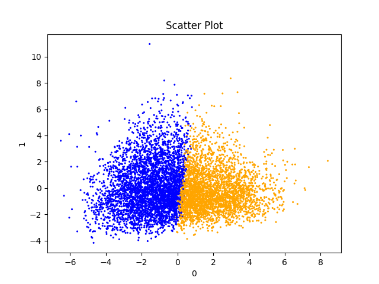
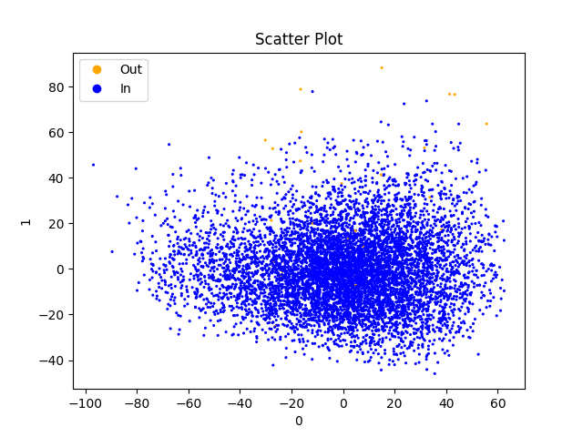

# CMPT 459 Final Project Report
David Wiebe | 301470104 | dlw13@sfu.ca\
Rachel Lagasse | 301395285 | rlagasse@sfu.ca

## 1. Dataset - Rain in Australia
We've selected climatology [data from Kaggle](https://www.kaggle.com/datasets/jsphyg/weather-dataset-rattle-package) titled "Rain in Australia". This real-world dataset contains 10 years of rainfall data collected from various Australian weather stations. It has 23 columns including a mix of numeric and categorical data. It has over 140,000 entries and a total size of 140MB.

The data includes a rich set of features to analyze. Numeric features include humidity, temperature and wind speed. Categorical features include location and wind direction. Most columns are numeric, which may affect our choice of classifiers. Our target variable for classification will be RainTomorrow which predicts if there is rainfall the next day (>= 1mm).

Cleaning needs to be done on the data. This is expected to be a straight forward task, primarily replacing N/A values with medians and modes of numerical and categorical values, respectively. Upon surface inspection there do not appear to be any obvious issues i.e. no data has massive amounts of missing information. 3267 of the target RainTomorrow columns are N/A which we will likely drop to ensure we don't introduce bias into our data.

For data preprocessing ideas, we may extract the Month as another column to see if the month-to-month weather conditions vary. We may group the MinTemp and MaxTemp columns into various temperature regions. For the Location column, we may perform one-hot encoding to convert each weather station location into a unique numerical value the applied data mining techniques can better understand.

## 2. Data Preprocessing
1. We remove columns with $\gt 30\%$ missing data
2. Remaining missing numerical data is imputed to the mean
3. Remaining missing categorical data is imputed to the mode
4. We have deferred normalization of numerical features until it is needed
   - EDA works better if we have non-normalized features
5. Our dataset is large enough we don't need to create synthetic data
6. We have parameterized data reduction and run our tests with `--data-reduction=20`
7. The minority class (it rains) is about a quarter of the data set, it doesn't need augmentation
8. Our data has insufficient dimensionality to require PCA

## 3. Exploratory Data Analysis
1. Find high and low variances, correlations in the data set.
2. Create scatter plots of all relations
3. Highlight [interesting plots](###interesting-plots)

### 3.1 Interesting Plots

## 4. Clustering
1. Gather clustering algorithms
   - We chose KMeans, OPTICS, and DBSCAN
2. We performed these clusterings
   - finding a good `eps` value for DBSCAN was hard. We chose 3
3. We found runtimes, Silhouette scores
4. Created visualizations

### 4.1 Clustering Performance
| Metric            | KMeans | OPTICS | DBSCAN |
| ----------------- | ------ | ------ | ------ |
| Runtime           | 0.187  | 11.191 | 0.097  |
| Silhouette Scores | 0.172  | -0.392 | 0.581  |

### 4.2 Plots

## 5. Outlier Detection
1. Choose outlier detection methods
   - Local Outlier Factor
   - Kernel Density
2. Plot outliers
   - They either selected $\lt 1%$ outliers or almost all outliers
   - This makes sense; our data is professionally collected

### 5.1 Plots

## 6. Feature Selection
1. We selected 3 feature selection methods
   - Recursive Feature Elimination
   - Lasso Regression
   - Mutual Information
2. We ran these clustering algorithms to get out 5 columns

### 6.1 Selected Features
| Columns Kept    | Recursive Feature | Lasso Regression | Mutual Information | Fraction |
| --------------- | ----------------- | ---------------- | ------------------ | -------- |
| Rainfall        | X                 | X                | X                  | $3/3$    |
| Wind Gust Speed | X                 | X                |                    | $2/3$    |
| Wind Speed 3 pm |                   | X                |                    | $1/3$    |
| Humidity 9 am   |                   |                  | X                  | $1/3$    |
| Humidity 3 pm   | X                 | X                | X                  | $3/3$    |
| Pressure 9 am   | X                 |                  | X                  | $2/3$    |
| Pressure 3 pm   | X                 | X                | X                  | $3/3$    |

### 6.2 Discussion of Selected Features
Three features are selected by all of the three models. 
These features are Rainfall, Humidity at 3 pm, and Pressure at 3 pm.
- Rainfall today is an obvious predictor of rainfall tomorrow
- Humidity and pressure both make sense for weather prediction

Humidity and pressure were both more commonly referenced at 3 pm vs 9 am.
This implies weather conditions later in the day have stronger predictive powers than those later in the day.
Of course this is obvious to us humans, but its cool the feature selection figured it out.

## 7 Classification
1. We choose three base classifiers, and to make ensemble classifiers out of the best classifiers
   - Support Vector Machines
   - K Nearest Neighbours
   - Random Forest Classifiers
   - Voting Classifiers of size 3, 5, and 7
2. We chose 5 fold cross validation for performance
3. For metrics we picked 4 and sorted by accuracy
   - Accuracy
   - Precision
   - Recall
   - F1 score
4. Tests were run over 4 different datasets
   - All of the data 
   - Features picked by RFE
   - Features picked by Mutual Information
   - Features picked by Lasso
5. Bad Results
   - Support Vector machines did terribly
   - Random forests with `n_neighbours = 1` were also quite bad
   - Mutual Information tended to produce the worst classification result
6. Good Results
   - The best performing classifiers were the ensembles of size 3 and 5
   - The best 5 base classifiers were all KNNs

## 8 Hyperparameter Tuning
### Support Vector Machines
- SVMs had two tuned hyper parameters
- `C` The regularization strength
  - The best value was `C=6`, these has better accuracy than other SVMs
- `kernel` What kernel function should the SVM use
  - The worst was `kernel = 'sigmoid'`
  - The best was `kernel='linear'`
  - This is likely because the corrections between features get lost when transformed 

### K Nearest Neighbours
- KNNs have one tuned hyper parameter
- `n_neighbours` How many neighbours should this check? 
   - The best 5 base classifiers were all KNNs with `n_neighbours > 15`
   - This is quite impressive given the data set

### Random Forest Classifiers
- Random Forests have only one hyper parameter tuned
- `n_estimators` How many decision trees should be trained?
  - Higher numbers of decision trees do better overall
  - KNNs with `n_estimators=17, 19` were in the top 15 of all classifiers

### Ensemble Classifiers
- We used Voting Classifiers of sizes 3, 5, and 7
- Size 3 did the best of all of them
- Size 5 was right behind
- Sizes 3 and 5 did better than all other classifiers
- Size 7 interestingly did worse than the best 3 base classifiers

## Appendix A - Classification results
| Accuracy | Precision | Recall | F1 | Dataset | Classifier |
| -------- | --------- | ------ | -- | ------- | ---------- |
| 0.5882 | 0.0726 | 0.0724 | 0.0724 | mutual | SVC(C=5, kernel='sigmoid') |
| 0.5883 | 0.0727 | 0.0724 | 0.0725 | mutual | SVC(C=6, kernel='sigmoid') |
| 0.5883 | 0.0727 | 0.0724 | 0.0725 | mutual | SVC(C=7, kernel='sigmoid') |
| 0.5883 | 0.0737 | 0.0736 | 0.0736 | mutual | SVC(C=9, kernel='sigmoid') |
| 0.5883 | 0.0732 | 0.073 | 0.073 | mutual | SVC(C=8, kernel='sigmoid') |
| 0.5885 | 0.0727 | 0.0724 | 0.0725 | mutual | SVC(C=4, kernel='sigmoid') |
| 0.5886 | 0.0723 | 0.0718 | 0.072 | mutual | SVC(C=3, kernel='sigmoid') |
| 0.589 | 0.0718 | 0.0712 | 0.0714 | mutual | SVC(C=2, kernel='sigmoid') |
| 0.5901 | 0.0716 | 0.0705 | 0.071 | mutual | SVC(C=1, kernel='sigmoid') |
| 0.7437 | 0.4281 | 0.4453 | 0.4357 | mutual | RandomForestClassifier(n_estimators=1) |
| 0.7594 | 0.4623 | 0.4723 | 0.4654 | all    | RandomForestClassifier(n_estimators=1) |
| 0.7628 | 0.4659 | 0.4634 | 0.4644 | rfe    | RandomForestClassifier(n_estimators=1) |
| 0.763 | 0.466 | 0.4584 | 0.4616 | mutual | KNeighborsClassifier(n_neighbors=1) |
| 0.7678 | 0.479 | 0.4942 | 0.4854 | lasso  | RandomForestClassifier(n_estimators=1) |
| 0.7683 | 0.4794 | 0.4715 | 0.4743 | rfe    | KNeighborsClassifier(n_neighbors=1) |
| 0.7734 | 0.4904 | 0.4782 | 0.4834 | lasso  | KNeighborsClassifier(n_neighbors=1) |
| 0.7775 | 0.0 | 0.0 | 0.0 | all    | SVC(C=1, kernel='poly') |
| 0.7775 | 0.0 | 0.0 | 0.0 | all    | SVC(C=1) |
| 0.7775 | 0.0 | 0.0 | 0.0 | all    | SVC(C=1, kernel='sigmoid') |
| 0.7775 | 0.0 | 0.0 | 0.0 | all    | SVC(C=2) |
| 0.7775 | 0.0 | 0.0 | 0.0 | all    | SVC(C=2, kernel='sigmoid') |
| 0.7775 | 0.0 | 0.0 | 0.0 | all    | SVC(C=3, kernel='sigmoid') |
| 0.7775 | 0.0 | 0.0 | 0.0 | all    | SVC(C=4, kernel='sigmoid') |
| 0.7775 | 0.0 | 0.0 | 0.0 | all    | SVC(C=5, kernel='sigmoid') |
| 0.7775 | 0.0 | 0.0 | 0.0 | all    | SVC(C=6, kernel='sigmoid') |
| 0.7775 | 0.0 | 0.0 | 0.0 | all    | SVC(C=7, kernel='sigmoid') |
| 0.7775 | 0.0 | 0.0 | 0.0 | all    | SVC(C=8, kernel='sigmoid') |
| 0.7775 | 0.0 | 0.0 | 0.0 | all    | SVC(C=9, kernel='sigmoid') |
| 0.7775 | 0.0 | 0.0 | 0.0 | rfe    | SVC(C=1, kernel='sigmoid') |
| 0.7775 | 0.0 | 0.0 | 0.0 | rfe    | SVC(C=2, kernel='sigmoid') |
| 0.7775 | 0.0 | 0.0 | 0.0 | rfe    | SVC(C=3, kernel='sigmoid') |
| 0.7775 | 0.0 | 0.0 | 0.0 | rfe    | SVC(C=4, kernel='sigmoid') |
| 0.7775 | 0.0 | 0.0 | 0.0 | rfe    | SVC(C=5, kernel='sigmoid') |
| 0.7775 | 0.0 | 0.0 | 0.0 | rfe    | SVC(C=6, kernel='sigmoid') |
| 0.7775 | 0.0 | 0.0 | 0.0 | rfe    | SVC(C=7, kernel='sigmoid') |
| 0.7775 | 0.0 | 0.0 | 0.0 | lasso  | SVC(C=1, kernel='sigmoid') |
| 0.7775 | 0.0 | 0.0 | 0.0 | lasso  | SVC(C=2, kernel='sigmoid') |
| 0.7777 | 0.2 | 0.0006 | 0.0013 | all    | SVC(C=3) |
| 0.7777 | 0.2 | 0.0006 | 0.0013 | lasso  | SVC(C=3, kernel='sigmoid') |
| 0.7778 | 0.4 | 0.0013 | 0.0026 | rfe    | SVC(C=8, kernel='sigmoid') |
| 0.7778 | 0.2 | 0.0013 | 0.0025 | lasso  | SVC(C=4, kernel='sigmoid') |
| 0.7779 | 0.5333 | 0.0031 | 0.0062 | rfe    | SVC(C=9, kernel='sigmoid') |
| 0.7779 | 0.4 | 0.0019 | 0.0038 | all    | SVC(C=4) |
| 0.7779 | 0.4 | 0.0019 | 0.0038 | lasso  | SVC(C=5, kernel='sigmoid') |
| 0.7782 | 0.6 | 0.0033 | 0.0065 | rfe    | SVC(C=1) |
| 0.779 | 0.8 | 0.0072 | 0.0142 | all    | SVC(C=2, kernel='poly') |
| 0.779 | 0.8 | 0.0072 | 0.0142 | all    | SVC(C=5) |
| 0.779 | 1.0 | 0.0069 | 0.0137 | lasso  | SVC(C=6, kernel='sigmoid') |
| 0.78 | 1.0 | 0.0116 | 0.0229 | lasso  | SVC(C=1) |
| 0.7808 | 1.0 | 0.0155 | 0.0303 | all    | SVC(C=6) |
| 0.7808 | 0.8636 | 0.0179 | 0.035 | lasso  | SVC(C=7, kernel='sigmoid') |
| 0.7839 | 0.9473 | 0.0317 | 0.0605 | all    | SVC(C=7) |
| 0.784 | 0.8954 | 0.0337 | 0.0646 | lasso  | SVC(C=8, kernel='sigmoid') |
| 0.784 | 0.5153 | 0.496 | 0.5047 | all    | KNeighborsClassifier(n_neighbors=1) |
| 0.7854 | 0.9424 | 0.0399 | 0.0754 | all    | SVC(C=3, kernel='poly') |
| 0.7866 | 0.8686 | 0.0494 | 0.0929 | lasso  | SVC(C=9, kernel='sigmoid') |
| 0.7867 | 0.9388 | 0.0468 | 0.0879 | rfe    | SVC(C=2) |
| 0.7878 | 0.9278 | 0.0517 | 0.0968 | all    | SVC(C=8) |
| 0.7918 | 0.5378 | 0.4491 | 0.4891 | mutual | RandomForestClassifier(n_estimators=3) |
| 0.7918 | 0.9246 | 0.0725 | 0.1327 | all    | SVC(C=9) |
| 0.7961 | 0.5476 | 0.4844 | 0.5124 | lasso  | RandomForestClassifier(n_estimators=3) |
| 0.7973 | 0.9236 | 0.1017 | 0.18 | all    | SVC(C=4, kernel='poly') |
| 0.7988 | 0.5573 | 0.4712 | 0.5097 | rfe    | RandomForestClassifier(n_estimators=3) |
| 0.8002 | 0.9074 | 0.1193 | 0.2071 | lasso  | SVC(C=2) |
| 0.8019 | 0.5652 | 0.4743 | 0.5153 | all    | RandomForestClassifier(n_estimators=3) |
| 0.8034 | 0.8906 | 0.1378 | 0.2355 | rfe    | SVC(C=3) |
| 0.8035 | 0.5746 | 0.4512 | 0.5043 | rfe    | KNeighborsClassifier(n_neighbors=3) |
| 0.8038 | 0.5799 | 0.4295 | 0.4926 | mutual | KNeighborsClassifier(n_neighbors=3) |
| 0.8038 | 0.5717 | 0.4653 | 0.5124 | rfe    | RandomForestClassifier(n_estimators=5) |
| 0.8042 | 0.5735 | 0.464 | 0.5122 | lasso  | RandomForestClassifier(n_estimators=5) |
| 0.8059 | 0.8673 | 0.1556 | 0.2601 | all    | SVC(C=5, kernel='poly') |
| 0.8063 | 0.5821 | 0.4546 | 0.5103 | mutual | RandomForestClassifier(n_estimators=5) |
| 0.8089 | 0.5934 | 0.4499 | 0.511 | mutual | RandomForestClassifier(n_estimators=7) |
| 0.8104 | 0.5951 | 0.46 | 0.5181 | lasso  | KNeighborsClassifier(n_neighbors=3) |
| 0.8112 | 0.5972 | 0.4683 | 0.5237 | lasso  | RandomForestClassifier(n_estimators=7) |
| 0.8126 | 0.7642 | 0.2388 | 0.3577 | mutual | SVC(C=1, kernel='linear') |
| 0.813 | 0.7638 | 0.2428 | 0.3616 | mutual | SVC(C=2, kernel='linear') |
| 0.8138 | 0.8406 | 0.2059 | 0.3282 | all    | SVC(C=6, kernel='poly') |
| 0.8142 | 0.83 | 0.2121 | 0.335 | rfe    | SVC(C=4) |
| 0.8147 | 0.6064 | 0.4769 | 0.5329 | rfe    | RandomForestClassifier(n_estimators=7) |
| 0.8152 | 0.6176 | 0.4451 | 0.5169 | mutual | RandomForestClassifier(n_estimators=9) |
| 0.8156 | 0.7682 | 0.2568 | 0.3786 | mutual | SVC(C=3, kernel='linear') |
| 0.8156 | 0.6144 | 0.4643 | 0.5276 | rfe    | RandomForestClassifier(n_estimators=11) |
| 0.816 | 0.6157 | 0.4651 | 0.5286 | rfe    | RandomForestClassifier(n_estimators=9) |
| 0.8162 | 0.8394 | 0.2209 | 0.346 | lasso  | SVC(C=1, kernel='poly') |
| 0.8162 | 0.6223 | 0.4408 | 0.5152 | rfe    | KNeighborsClassifier() |
| 0.8163 | 0.8378 | 0.222 | 0.3474 | lasso  | SVC(C=3) |
| 0.818 | 0.621 | 0.471 | 0.5339 | lasso  | RandomForestClassifier(n_estimators=9) |
| 0.8181 | 0.6266 | 0.4515 | 0.5242 | rfe    | RandomForestClassifier(n_estimators=13) |
| 0.8185 | 0.6216 | 0.4733 | 0.536 | all    | RandomForestClassifier(n_estimators=5) |
| 0.8192 | 0.6279 | 0.4604 | 0.5303 | rfe    | RandomForestClassifier(n_estimators=17) |
| 0.8196 | 0.6227 | 0.4791 | 0.5407 | all    | KNeighborsClassifier(n_neighbors=3) |
| 0.82 | 0.6389 | 0.4363 | 0.5181 | mutual | RandomForestClassifier(n_estimators=11) |
| 0.8204 | 0.8377 | 0.2444 | 0.3754 | all    | SVC(C=7, kernel='poly') |
| 0.8204 | 0.6342 | 0.4591 | 0.5314 | lasso  | RandomForestClassifier(n_estimators=13) |
| 0.8206 | 0.6449 | 0.4329 | 0.5169 | mutual | KNeighborsClassifier() |
| 0.8207 | 0.6311 | 0.4649 | 0.5347 | all    | RandomForestClassifier(n_estimators=7) |
| 0.8207 | 0.6359 | 0.4552 | 0.5295 | rfe    | RandomForestClassifier(n_estimators=19) |
| 0.8215 | 0.7747 | 0.2865 | 0.4147 | mutual | SVC(C=4, kernel='linear') |
| 0.8217 | 0.6338 | 0.472 | 0.5401 | lasso  | RandomForestClassifier(n_estimators=11) |
| 0.8219 | 0.6339 | 0.4769 | 0.5427 | lasso  | RandomForestClassifier(n_estimators=15) |
| 0.8221 | 0.646 | 0.4411 | 0.5238 | mutual | RandomForestClassifier(n_estimators=13) |
| 0.8226 | 0.8259 | 0.2616 | 0.3946 | rfe    | SVC(C=5) |
| 0.8232 | 0.8204 | 0.2675 | 0.401 | rfe    | SVC(C=1, kernel='poly') |
| 0.8233 | 0.6455 | 0.4586 | 0.5351 | rfe    | RandomForestClassifier(n_estimators=15) |
| 0.8235 | 0.8252 | 0.2664 | 0.4005 | all    | SVC(C=8, kernel='poly') |
| 0.8235 | 0.6415 | 0.4678 | 0.5399 | lasso  | RandomForestClassifier(n_estimators=17) |
| 0.8251 | 0.6537 | 0.4519 | 0.534 | mutual | RandomForestClassifier(n_estimators=17) |
| 0.8254 | 0.6546 | 0.4513 | 0.5341 | mutual | RandomForestClassifier(n_estimators=19) |
| 0.8257 | 0.8225 | 0.2808 | 0.4162 | lasso  | SVC(C=4) |
| 0.8257 | 0.665 | 0.4366 | 0.5262 | rfe    | KNeighborsClassifier(n_neighbors=7) |
| 0.8258 | 0.6578 | 0.4508 | 0.5341 | lasso  | KNeighborsClassifier() |
| 0.8262 | 0.6554 | 0.4603 | 0.5404 | all    | RandomForestClassifier(n_estimators=9) |
| 0.8263 | 0.8163 | 0.288 | 0.4234 | rfe    | SVC(C=6) |
| 0.8263 | 0.6807 | 0.4154 | 0.5149 | mutual | KNeighborsClassifier(n_neighbors=9) |
| 0.827 | 0.8179 | 0.2912 | 0.4271 | all    | SVC(C=9, kernel='poly') |
| 0.8272 | 0.6636 | 0.4509 | 0.5365 | mutual | RandomForestClassifier(n_estimators=15) |
| 0.8273 | 0.7708 | 0.3227 | 0.453 | mutual | SVC(C=5, kernel='linear') |
| 0.8274 | 0.6772 | 0.4307 | 0.5255 | mutual | KNeighborsClassifier(n_neighbors=7) |
| 0.8281 | 0.809 | 0.3032 | 0.4386 | rfe    | SVC(C=7) |
| 0.8283 | 0.6588 | 0.4743 | 0.5505 | lasso  | RandomForestClassifier(n_estimators=19) |
| 0.8294 | 0.8069 | 0.3105 | 0.4464 | lasso  | SVC(C=5) |
| 0.8296 | 0.7794 | 0.3252 | 0.4586 | mutual | SVC(C=2, kernel='poly') |
| 0.8296 | 0.7801 | 0.3246 | 0.4581 | mutual | SVC(C=1, kernel='poly') |
| 0.8299 | 0.7599 | 0.3454 | 0.474 | mutual | SVC(C=6, kernel='linear') |
| 0.8301 | 0.7784 | 0.3291 | 0.462 | mutual | SVC(C=4, kernel='poly') |
| 0.8301 | 0.7802 | 0.3279 | 0.4612 | mutual | SVC(C=3, kernel='poly') |
| 0.8301 | 0.8041 | 0.3165 | 0.4522 | rfe    | SVC(C=8) |
| 0.8301 | 0.7801 | 0.3288 | 0.4619 | mutual | SVC(C=8, kernel='poly') |
| 0.8302 | 0.7951 | 0.3234 | 0.4578 | rfe    | SVC(C=9) |
| 0.8302 | 0.7013 | 0.4135 | 0.5192 | mutual | KNeighborsClassifier(n_neighbors=11) |
| 0.8303 | 0.7818 | 0.3286 | 0.4621 | mutual | SVC(C=5, kernel='poly') |
| 0.8303 | 0.7822 | 0.3288 | 0.4623 | mutual | SVC(C=7, kernel='poly') |
| 0.8305 | 0.6709 | 0.4702 | 0.5515 | all    | RandomForestClassifier(n_estimators=11) |
| 0.8306 | 0.6883 | 0.4382 | 0.5342 | rfe    | KNeighborsClassifier(n_neighbors=9) |
| 0.8307 | 0.7084 | 0.4076 | 0.5165 | mutual | KNeighborsClassifier(n_neighbors=13) |
| 0.8307 | 0.7827 | 0.3304 | 0.4641 | mutual | SVC(C=6, kernel='poly') |
| 0.8307 | 0.7816 | 0.3318 | 0.4651 | mutual | SVC(C=9, kernel='poly') |
| 0.831 | 0.7803 | 0.341 | 0.472 | rfe    | SVC(C=2, kernel='poly') |
| 0.8314 | 0.7845 | 0.3347 | 0.4684 | mutual | SVC(C=3) |
| 0.8314 | 0.7841 | 0.3346 | 0.4684 | mutual | SVC(C=2) |
| 0.8314 | 0.7843 | 0.3347 | 0.4685 | mutual | SVC(C=1) |
| 0.8316 | 0.785 | 0.3355 | 0.4692 | mutual | SVC(C=5) |
| 0.8316 | 0.723 | 0.3953 | 0.51 | mutual | KNeighborsClassifier(n_neighbors=19) |
| 0.8316 | 0.6791 | 0.4605 | 0.5481 | all    | KNeighborsClassifier() |
| 0.8317 | 0.7861 | 0.3355 | 0.4694 | mutual | SVC(C=6) |
| 0.8317 | 0.7197 | 0.3989 | 0.5125 | mutual | KNeighborsClassifier(n_neighbors=17) |
| 0.8317 | 0.7303 | 0.3877 | 0.5055 | mutual | KNeighborsClassifier(n_neighbors=25) |
| 0.8318 | 0.7854 | 0.3367 | 0.4705 | mutual | SVC(C=7) |
| 0.8318 | 0.7862 | 0.3362 | 0.4701 | mutual | SVC(C=4) |
| 0.8318 | 0.7295 | 0.3884 | 0.5062 | mutual | KNeighborsClassifier(n_neighbors=23) |
| 0.8318 | 0.6845 | 0.4529 | 0.5441 | lasso  | KNeighborsClassifier(n_neighbors=7) |
| 0.8318 | 0.6987 | 0.4328 | 0.5331 | rfe    | KNeighborsClassifier(n_neighbors=11) |
| 0.832 | 0.7337 | 0.3858 | 0.5048 | mutual | KNeighborsClassifier(n_neighbors=27) |
| 0.832 | 0.7856 | 0.3373 | 0.4711 | mutual | SVC(C=8) |
| 0.832 | 0.7855 | 0.3372 | 0.471 | mutual | SVC(C=9) |
| 0.832 | 0.7261 | 0.3934 | 0.5096 | mutual | KNeighborsClassifier(n_neighbors=21) |
| 0.832 | 0.759 | 0.3595 | 0.4871 | mutual | SVC(C=7, kernel='linear') |
| 0.8321 | 0.719 | 0.4043 | 0.5164 | mutual | KNeighborsClassifier(n_neighbors=15) |
| 0.8323 | 0.7388 | 0.3823 | 0.5029 | mutual | KNeighborsClassifier(n_neighbors=29) |
| 0.8325 | 0.7516 | 0.368 | 0.4936 | mutual | SVC(C=9, kernel='linear') |
| 0.8327 | 0.8029 | 0.3317 | 0.4678 | lasso  | SVC(C=6) |
| 0.8327 | 0.8002 | 0.3344 | 0.4698 | lasso  | SVC(C=2, kernel='poly') |
| 0.8328 | 0.7055 | 0.4307 | 0.5334 | rfe    | KNeighborsClassifier(n_neighbors=13) |
| 0.8334 | 0.7603 | 0.3664 | 0.4938 | mutual | SVC(C=8, kernel='linear') |
| 0.8335 | 0.7094 | 0.428 | 0.5329 | rfe    | KNeighborsClassifier(n_neighbors=19) |
| 0.8335 | 0.7115 | 0.425 | 0.5312 | rfe    | KNeighborsClassifier(n_neighbors=21) |
| 0.8336 | 0.7985 | 0.3404 | 0.4757 | lasso  | SVC(C=7) |
| 0.8338 | 0.7029 | 0.4383 | 0.539 | all    | KNeighborsClassifier(n_neighbors=7) |
| 0.8339 | 0.7861 | 0.3498 | 0.483 | lasso  | SVC(C=8) |
| 0.8339 | 0.7673 | 0.3659 | 0.4941 | lasso  | SVC(C=4, kernel='poly') |
| 0.8339 | 0.7583 | 0.3738 | 0.4994 | lasso  | SVC(C=5, kernel='poly') |
| 0.8339 | 0.7527 | 0.38 | 0.5034 | lasso  | SVC(C=6, kernel='poly') |
| 0.834 | 0.7792 | 0.356 | 0.4876 | lasso  | SVC(C=9) |
| 0.8342 | 0.7702 | 0.3683 | 0.496 | rfe    | SVC(C=3, kernel='poly') |
| 0.8343 | 0.7613 | 0.3761 | 0.5014 | rfe    | SVC(C=4, kernel='poly') |
| 0.8345 | 0.7513 | 0.3858 | 0.5081 | lasso  | SVC(C=7, kernel='poly') |
| 0.8346 | 0.6949 | 0.4582 | 0.5514 | all    | RandomForestClassifier(n_estimators=15) |
| 0.8346 | 0.7829 | 0.3573 | 0.4892 | lasso  | SVC(C=3, kernel='poly') |
| 0.8346 | 0.7167 | 0.4256 | 0.5332 | rfe    | KNeighborsClassifier(n_neighbors=23) |
| 0.8346 | 0.7046 | 0.443 | 0.543 | lasso  | KNeighborsClassifier(n_neighbors=9) |
| 0.8349 | 0.7501 | 0.3903 | 0.5116 | lasso  | SVC(C=8, kernel='poly') |
| 0.8349 | 0.7487 | 0.3923 | 0.5127 | lasso  | SVC(C=9, kernel='poly') |
| 0.835 | 0.7525 | 0.3881 | 0.5105 | rfe    | SVC(C=6, kernel='poly') |
| 0.835 | 0.7201 | 0.4233 | 0.5323 | rfe    | SVC(C=2, kernel='linear') |
| 0.8351 | 0.7548 | 0.3862 | 0.5094 | rfe    | SVC(C=5, kernel='poly') |
| 0.8351 | 0.7235 | 0.4194 | 0.5301 | all    | KNeighborsClassifier(n_neighbors=13) |
| 0.8353 | 0.7489 | 0.3947 | 0.515 | rfe    | SVC(C=8, kernel='poly') |
| 0.8353 | 0.6897 | 0.4712 | 0.5593 | all    | RandomForestClassifier(n_estimators=13) |
| 0.8353 | 0.7196 | 0.4258 | 0.5342 | rfe    | SVC(C=1, kernel='linear') |
| 0.8356 | 0.7512 | 0.394 | 0.5151 | rfe    | SVC(C=7, kernel='poly') |
| 0.8356 | 0.7249 | 0.4224 | 0.5326 | rfe    | KNeighborsClassifier(n_neighbors=25) |
| 0.8356 | 0.7177 | 0.4327 | 0.5385 | rfe    | KNeighborsClassifier(n_neighbors=15) |
| 0.8357 | 0.7098 | 0.4452 | 0.5456 | all    | SVC(C=5, kernel='linear') |
| 0.8357 | 0.7227 | 0.426 | 0.5349 | rfe    | SVC(C=5, kernel='linear') |
| 0.8358 | 0.7504 | 0.3966 | 0.517 | rfe    | SVC(C=9, kernel='poly') |
| 0.8358 | 0.7078 | 0.4522 | 0.5496 | all    | SVC(C=4, kernel='linear') |
| 0.8358 | 0.722 | 0.4272 | 0.5358 | rfe    | SVC(C=6, kernel='linear') |
| 0.836 | 0.7034 | 0.4596 | 0.5541 | all    | SVC(C=7, kernel='linear') |
| 0.836 | 0.725 | 0.4247 | 0.5346 | rfe    | SVC(C=9, kernel='linear') |
| 0.836 | 0.7254 | 0.4241 | 0.5342 | rfe    | SVC(C=8, kernel='linear') |
| 0.836 | 0.7223 | 0.4278 | 0.5363 | rfe    | SVC(C=4, kernel='linear') |
| 0.836 | 0.7184 | 0.4342 | 0.5402 | rfe    | KNeighborsClassifier(n_neighbors=17) |
| 0.8361 | 0.7095 | 0.4506 | 0.5494 | lasso  | SVC(C=4, kernel='linear') |
| 0.8361 | 0.7236 | 0.4272 | 0.5363 | rfe    | SVC(C=7, kernel='linear') |
| 0.8361 | 0.7288 | 0.4198 | 0.5318 | rfe    | KNeighborsClassifier(n_neighbors=27) |
| 0.8361 | 0.7132 | 0.4426 | 0.5451 | lasso  | KNeighborsClassifier(n_neighbors=11) |
| 0.8362 | 0.7153 | 0.441 | 0.5443 | lasso  | SVC(C=1, kernel='linear') |
| 0.8362 | 0.7099 | 0.449 | 0.5487 | lasso  | SVC(C=9, kernel='linear') |
| 0.8362 | 0.7104 | 0.4494 | 0.549 | all    | SVC(C=1, kernel='linear') |
| 0.8364 | 0.7214 | 0.433 | 0.5399 | all    | KNeighborsClassifier(n_neighbors=9) |
| 0.8364 | 0.7156 | 0.4404 | 0.5442 | lasso  | KNeighborsClassifier(n_neighbors=15) |
| 0.8364 | 0.7193 | 0.4362 | 0.5419 | lasso  | KNeighborsClassifier(n_neighbors=13) |
| 0.8364 | 0.7222 | 0.4298 | 0.5381 | all    | KNeighborsClassifier(n_neighbors=11) |
| 0.8365 | 0.7125 | 0.448 | 0.5486 | lasso  | SVC(C=2, kernel='linear') |
| 0.8365 | 0.7111 | 0.4511 | 0.5503 | lasso  | SVC(C=5, kernel='linear') |
| 0.8365 | 0.7128 | 0.4486 | 0.5489 | lasso  | SVC(C=8, kernel='linear') |
| 0.8365 | 0.7232 | 0.4302 | 0.5386 | rfe    | SVC(C=3, kernel='linear') |
| 0.8365 | 0.7314 | 0.4195 | 0.5323 | rfe    | KNeighborsClassifier(n_neighbors=29) |
| 0.8368 | 0.712 | 0.4525 | 0.5513 | lasso  | SVC(C=7, kernel='linear') |
| 0.8369 | 0.7114 | 0.4517 | 0.5512 | all    | SVC(C=2, kernel='linear') |
| 0.8369 | 0.7154 | 0.446 | 0.5478 | all    | SVC(C=8, kernel='linear') |
| 0.8371 | 0.7147 | 0.4498 | 0.5504 | lasso  | SVC(C=3, kernel='linear') |
| 0.8371 | 0.7138 | 0.449 | 0.5497 | all    | SVC(C=3, kernel='linear') |
| 0.8373 | 0.7149 | 0.451 | 0.5514 | lasso  | SVC(C=6, kernel='linear') |
| 0.8373 | 0.7169 | 0.4511 | 0.5513 | all    | SVC(C=9, kernel='linear') |
| 0.8375 | 0.724 | 0.4381 | 0.5446 | lasso  | KNeighborsClassifier(n_neighbors=17) |
| 0.8375 | 0.7326 | 0.4248 | 0.5369 | all    | KNeighborsClassifier(n_neighbors=15) |
| 0.8376 | 0.7071 | 0.461 | 0.5575 | all    | RandomForestClassifier(n_estimators=17) |
| 0.8376 | 0.732 | 0.4281 | 0.5391 | lasso  | KNeighborsClassifier(n_neighbors=23) |
| 0.8378 | 0.7022 | 0.4712 | 0.5632 | all    | RandomForestClassifier(n_estimators=19) |
| 0.8379 | 0.7293 | 0.4333 | 0.5426 | lasso  | KNeighborsClassifier(n_neighbors=19) |
| 0.8383 | 0.7168 | 0.455 | 0.555 | all    | SVC(C=6, kernel='linear') |
| 0.8384 | 0.7352 | 0.4292 | 0.5411 | lasso  | KNeighborsClassifier(n_neighbors=25) |
| 0.8387 | 0.7344 | 0.433 | 0.5437 | lasso  | KNeighborsClassifier(n_neighbors=21) |
| 0.8387 | 0.7383 | 0.4265 | 0.5399 | lasso  | KNeighborsClassifier(n_neighbors=27) |
| 0.839 | 0.7491 | 0.4157 | 0.5338 | all    | KNeighborsClassifier(n_neighbors=21) |
| 0.8391 | 0.7574 | 0.4078 | 0.5293 | all    | KNeighborsClassifier(n_neighbors=25) |
| 0.8395 | 0.7474 | 0.421 | 0.5379 | all    | KNeighborsClassifier(n_neighbors=19) |
| 0.8395 | 0.7661 | 0.4017 | 0.5261 | all    | KNeighborsClassifier(n_neighbors=29) |
| 0.8402 | 0.7652 | 0.4073 | 0.5307 | all    | KNeighborsClassifier(n_neighbors=27) |
| 0.8402 | 0.7628 | 0.4106 | 0.5327 | all    | VotingClassifier(estimators=best_7) |
| 0.8404 | 0.7435 | 0.4315 | 0.5454 | lasso  | KNeighborsClassifier(n_neighbors=29) |
| 0.8408 | 0.7475 | 0.4296 | 0.5446 | all    | KNeighborsClassifier(n_neighbors=17) |
| 0.8411 | 0.7606 | 0.4167 | 0.5375 | all    | KNeighborsClassifier(n_neighbors=23) |
| 0.8412 | 0.7717 | 0.4071 | 0.5321 | all    | VotingClassifier(estimators=best_5) |
| 0.8416 | 0.7636 | 0.4174 | 0.5389 | all    | VotingClassifier(estimators=best_3) |