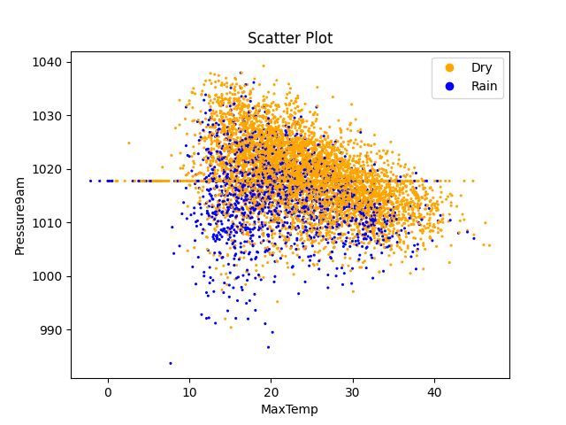
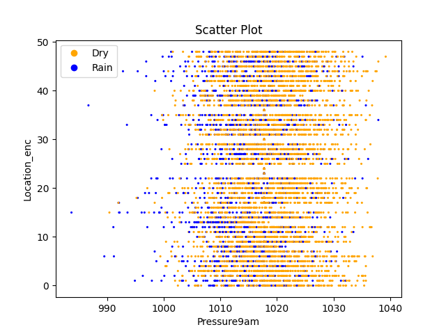
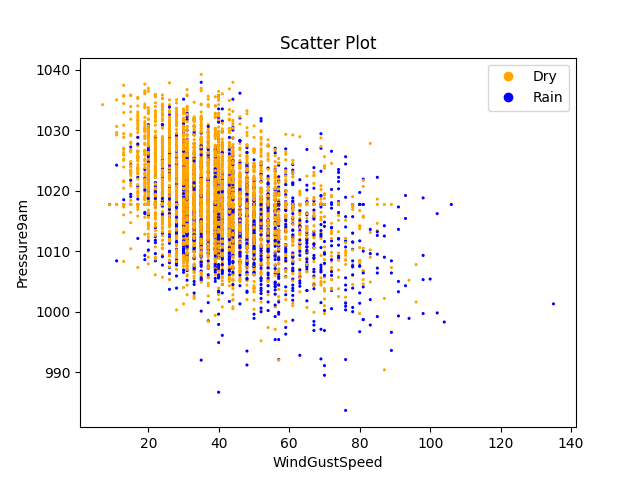

# CMPT 459 Final Project Report
David Wiebe | 301470104 | dlw13@sfu.ca\
Rachel Lagasse | 301395285 | rlagasse@sfu.ca

## 1. Dataset - Rain in Australia
We've selected climatology [data from Kaggle](https://www.kaggle.com/datasets/jsphyg/weather-dataset-rattle-package) titled "Rain in Australia". This real-world dataset contains 10 years of rainfall data collected from various Australian weather stations. It has 23 columns including a mix of numeric and categorical data. It has over 140,000 entries and a total size of 140MB.

The data includes a rich set of features to analyze. Numeric features include humidity, temperature and wind speed. Categorical features include location and wind direction. Most columns are numeric, which may affect our choice of classifiers. Our target variable for classification will be RainTomorrow which predicts if there is rainfall the next day (>= 1mm).

Cleaning needs to be done on the data. This is expected to be a straight forward task, primarily replacing N/A values with medians and modes of numerical and categorical values, respectively. Upon surface inspection there do not appear to be any obvious issues i.e. no data has massive amounts of missing information. 3267 of the target RainTomorrow columns are N/A which we will likely drop to ensure we don't introduce bias into our data.

For data preprocessing ideas, we may extract the Month as another column to see if the month-to-month weather conditions vary. We may group the MinTemp and MaxTemp columns into various temperature regions. For the Location column, we may perform one-hot encoding to convert each weather station location into a unique numerical value the applied data mining techniques can better understand.

## 2. Data Preprocessing
1. We remove columns with $\gt 30\%$ missing data
2. Remaining missing numerical data is imputed to the mean
3. Remaining missing categorical data is imputed to the mode
4. We have deferred normalization of numerical features until it is needed
   - EDA works better if we have non-normalized features
5. Our dataset is large enough we don't need to create synthetic data
6. The minority class (it rains) is about a quarter of the data set, it doesn't need augmentation
7. Our data has insufficient dimensionality to require PCA

## 3. Exploratory Data Analysis
1. Find high and low variances, correlations in the data set.
2. Create scatter plots of all relations
3. Highlight [interesting plots](###interesting-plots)

### 3.1 Interesting Plots

## 4. Clustering
1. Gather clustering algorithms
   - We chose KMeans, OPTICS, and DBSCAN
2. We performed these clusterings
   - finding a good `eps` value for DBSCAN was hard. We chose 3
3. We found runtimes, Silhouette scores
4. Created visualizations

### 4.1 Plots

## 6. Feature Selection
1. We selected 3 feature selection methods
   - Recursive Feature Elimination
   - Lasso Regression
   - Mutual Information
2. We ran these clustering algorithms to get out 5 columns

### 6.1 Selected Features
| Columns Kept    | Recursive Feature | Lasso Regression | Mutual Information | Fraction |
| --------------- | ----------------- | ---------------- | ------------------ | -------- |
| Rainfall        | X                 | X                | X                  | $3/3$    |
| Wind Gust Speed | X                 | X                |                    | $2/3$    |
| Wind Speed 3 pm |                   | X                |                    | $1/3$    |
| Humidity 9 am   |                   |                  | X                  | $1/3$    |
| Humidity 3 pm   | X                 | X                | X                  | $3/3$    |
| Pressure 9 am   | X                 |                  | X                  | $2/3$    |
| Pressure 3 pm   | X                 | X                | X                  | $3/3$    |

### 6.2 Discussion of Selected Features
Three features are selected by all three models. 
These features are Rainfall, Humidity at 3 pm, and Pressure at 3 pm.
- Rainfall today is an obvious predictor of rainfall tomorrow
- Humidity and pressure both make sense for weather prediction

Humidity and pressure were both more commonly referenced at 3 pm vs 9 am.
This implies weather conditions later in the day have stronger predictive powers than those later in the day.
Of course this is obvious to us humans, but its cool the feature selection figured it out.
